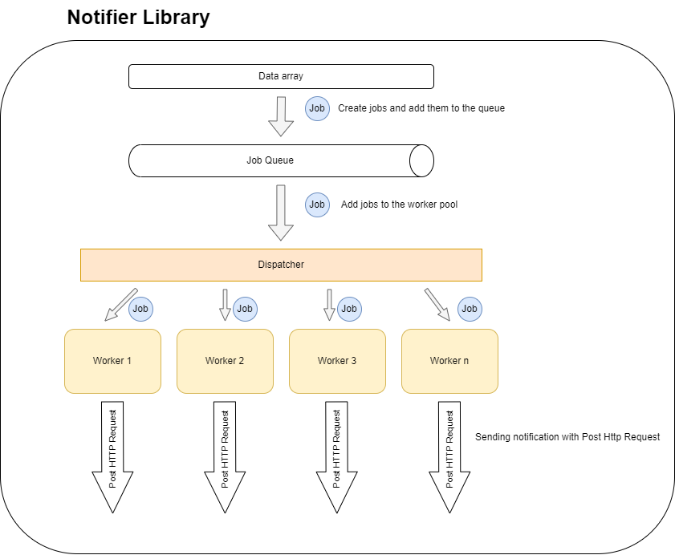

# Notifier
Scalable lightweight and efficient library for sending large number of notifications simultaneously.

## Architecture
To send large number of notification in efficient way, we implemented a worker pool and a dispatcher that listen to new
created job to dispatch it to an available worker. This work is attempts by using Go concurrency features like Goroutines
and channels.



## Prepare arguments
In order to use properly this library you should define the list of parameters below:
- `endpoint`: represents the url to post notifications
- `maxWorker`: define the maximum number of concurrent worker
- `maxQueue`: define the maximum length of messages queue
- `callback`: represents the callback function that will be called after sending all notifications. In case of sending errors,
this function can handle failures by accepting an array of failing requests.


## Create instance
Create instance of `Notifier` with the post endpoint, the number of workers required, the job queue size and the callback function
  ```
  notificationClient := notifier.CreateNewNotifier(endpoint, maxWorker, maxQueue, callback)
  ```

## Send notifications
Send notifications by passing the messages array with a non-blocking call
  ```
notificationClient.Notify(messages)
  ```

## Examples
You can find a use case example attached to this repository